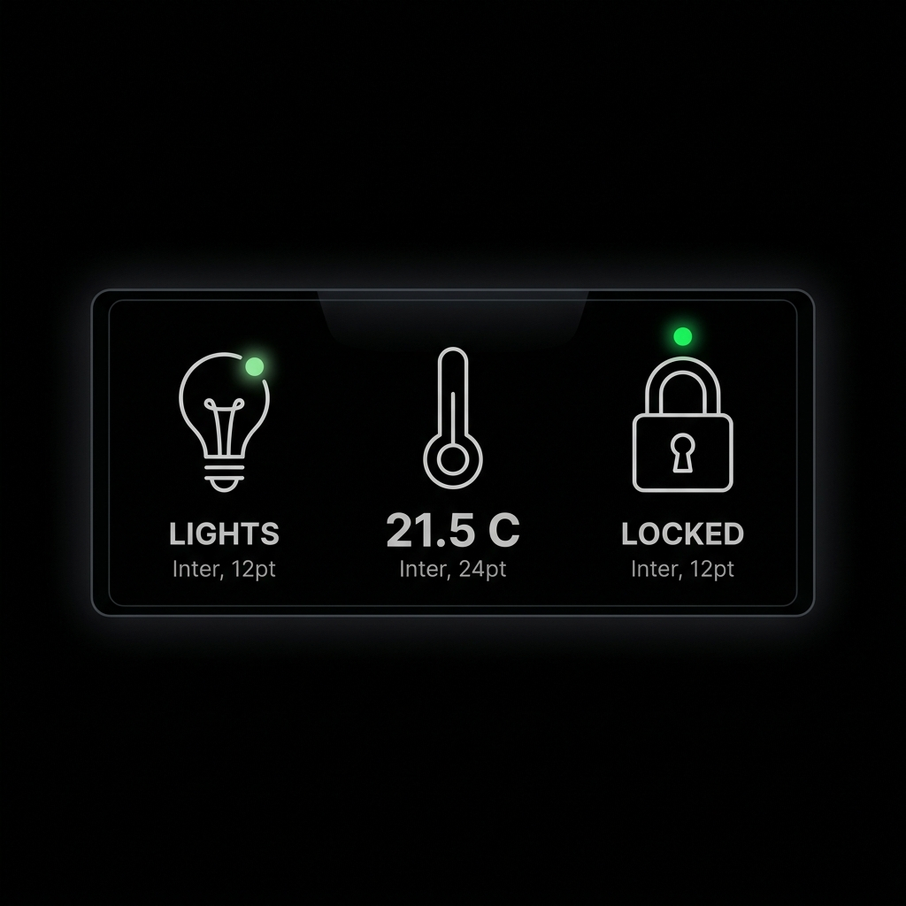

# mirrordash-homeassistant

A Home Assistant data-fetcher module for MirrorDash. It connects to a local Home Assistant REST API, retrieves the states of configured entity IDs, and presents them in a beautiful, responsive HUD layout.

## Features
- **Concurrent API Fetching**: Retrieves state data for all configured entities in parallel to ensure extremely fast refreshes.
- **Multiple Layout Options**: Choose between `"detailed"` (large primary reading and nested metadata footer) and `"compact"` (dense vertical layout with inline metadata).
- **Group Entities & Mix layouts**: Group your entities into custom categories/sections and assign a different layout style (`"detailed"` or `"compact"`) to each group inside the same widget.
- **Nested Telemetry Extraction**: Automatically extracts and displays battery, humidity, signal strength, and voltage attributes case-insensitively.
- **Default Icon Resolution**: Automatically resolves default Lucide icons based on entity domain and unit type (e.g. thermometer for temperature, droplet for humidity, lightbulb for lights) if no custom icon is specified.
- **Responsive Layout**: Adjusts layout alignment (left/right snapping) dynamically based on the mirror region it is placed in, and scales cleanly without fixed pixel widths.
- **Connection Error Warning**: Gracefully handles unreachable instances or authorization errors.

## Installation

```bash
uv pip install -e .
```

## Screenshot



## License
[PolyForm Noncommercial License 1.0.0](LICENSE.md)
